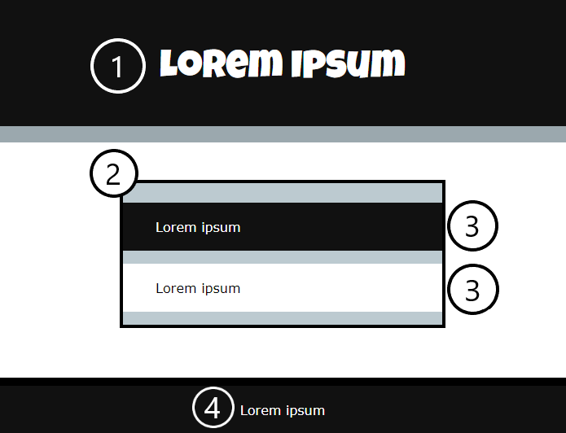

网页有四个基本部分可用于构建布局。

它们是：

1. 页眉 `<header>`
2. 主要内容 `<main>`
3. 一部分内容 `<section>`
4. 页脚 `<footer>`

**header** 通常包含网页的标题。

**main** 是您添加网页所有主要内容的地方。

**section** 用于将网页主要部分的内容划分为不同的区域。 这很有用，因为可以对每个部分应用不同的样式。

**footer** 可用于有趣的问候或重要信息，如联系方式或反馈表的链接。 它通常非常小。
